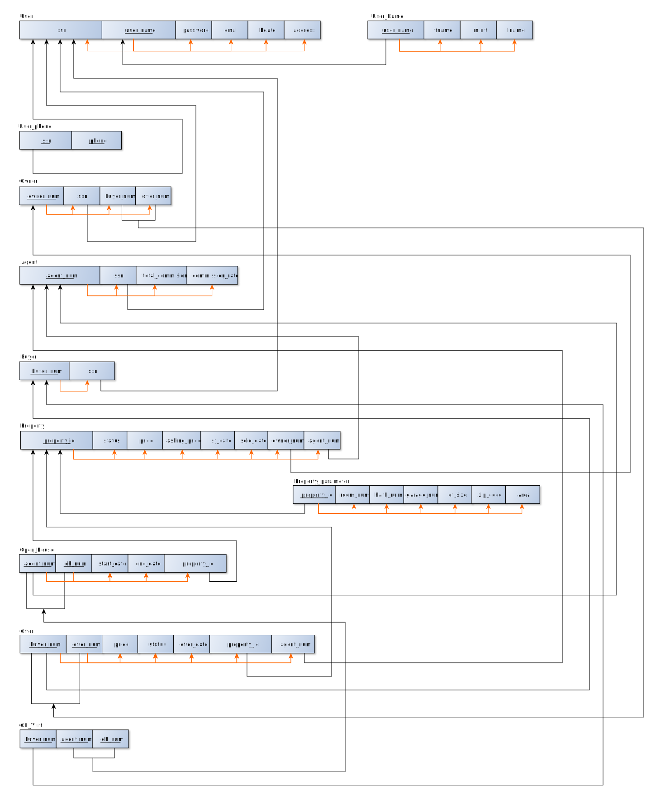

# 226 Term project RealEstateExchange

Welcome to the CMPE226-team 5 project!

Testing address: http://159.89.130.227/

## Resources used

[Flask official document](http://flask.pocoo.org/docs/0.12/)

[Flask-MySQL](https://flask-mysql.readthedocs.io/en/latest/)

`venv` module in Python 3.6, for details please refer [here](https://docs.python.org/3/library/venv.html).

(For differences of `virtualenv`, `pyvenv`, `venv`, `pyvenv`, `pyenv-virtualenv`, etc.,
please refer to this
[stack overflow question](https://stackoverflow.com/questions/41573587/what-is-the-difference-between-venv-pyvenv-pyenv-virtualenv-virtualenvwrappe).
This is one of the annoying problems among python versions.
In my experience, many popular libraries, such as TensorFlow and gRPC, use `virtualenv`. But for standard library usage, here we use `venv`.)

## Schema


## Run locally

Assume at local machine you already have a recent python 3 version (3.5 or 3.6) and pip.

```bash
# Use a separated environment
# Avoid the usage of like "pyvenv ~/flask"
# For reason please refer to the official document 
# https://docs.python.org/3/library/venv.html
python3 -m venv ~/flask

# Activate the environment 
source ~/flask/bin/activate

# Inside environment
# Install flask and other packages
pip install flask
pip install flask-mysql
pip install werkzeug

# clone this repository to your local
git clone https://github.com/ysmiles/RealEstateExchange.git

# Go to /app, run
python server.py

# Deactivation of Flask environment
deactivate
```

## Setting up MySQL database

Modify `server.py` at /app: change the following to your own local database user identification.

```
app.config['MYSQL_DATABASE_USER'] = 'user'
app.config['MYSQL_DATABASE_PASSWORD'] = 'pass'
```

To import DDL, go to /SQL, run

```
mysql < team5_final.sql -u yourusername -p
```

## A more complex running example by using docker

Actually the test address is deployed in this way.

Run a MySQL container and import the DDL.sql.

Run another python container to run the server.py.

So actually our database server and web server are separated.
This can lead to higher security level and extensibility of the whole app.

For reference of usage:

https://hub.docker.com/_/mysql/

https://hub.docker.com/_/python/


Docker container status at 159.89.130.227

```
# In the server run
docker ps

# Get output as follow
CONTAINER ID        IMAGE               COMMAND                  CREATED             STATUS              PORTS                  NAMES
8be62e7ecd5f        myimage             "python3"                About an hour ago   Up 8 minutes        0.0.0.0:80->5000/tcp   myapp
66edaa49762e        mysql               "docker-entrypoint..."   About an hour ago   Up About an hour    3306/tcp               realmysql
```